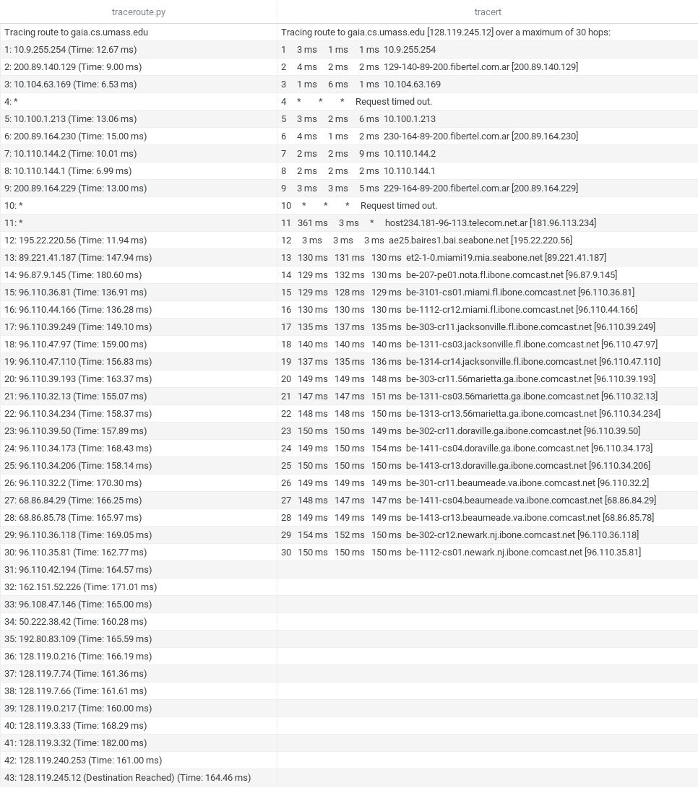

```{r setup, include=FALSE}
knitr::opts_chunk$set(echo = TRUE)
```


# Informe de Tecnología Digital 4

## Información General

- **Curso:** Tecnología Digital 4
- **Fecha:** [29 de octubre de 2023]
- **Profesores:** [Emmanuel Iarussi y Lucio Emilio Santi]
- **Estudiantes:** [Victor Navajas, Micaela Oliva y Exequiel Munoz]

## Resumen

En este informe, se abordan tres aspectos del análisis de redes. En la primera parte, implementamos Traceroute utilizando Python y Scapy para rastrear la ruta y los tiempos de respuesta entre un origen y un destino. En la segunda parte, desarrollamos un Port Scanner que detecta el estado de los puertos en un host. Este escáner puede considerar puertos abiertos, cerrados o filtrados y se extiende para verificar la conexión TCP completa. Finalmente, en la tercera parte, realizamos experimentos con estas herramientas en universidades de diferentes continentes y se analizan los resultados, incluyendo un análisis comparativo con la herramienta nmap, adicionalmente vamos a presentar experimentos realizados por nosotros. El informe busca proporcionar una visión integral de estas herramientas y sus aplicaciones en el análisis de redes.

## Índice

1. [Introducción](#1-introducción)
2. [Explicación de la Implementación](#2-explicación-de-la-implementación)
   - [Traceroute](#21-traceroute)
   - [Port Scanner I](#22-port-scanner-i)
   - [Port Scanner II](#23-port-scanner-ii)
3. [Experimentación](#3-experimentación)
   - [3.1](#31)
     - [a](#31a)
     - [b](#31b)
   - [3.2](#32)
     - [a](#32a)
     - [b](#32b)
     - [c](#32c)
     - [d](#32d)
4. [Conclusiones](#4-conclusiones)

## 1. Introducción

Traceroute...
Portscanner...

## 2. Explicación de la Implementación

### 2.1 Traceroute

Creamos una funcion llamada Traceroute donde pasamos como parametros al host destino y la cantidad maxima de TTL (Time to Live) que tendra ese paquete.
Usando la libreria Scapy para cada uno de los TTLs creamos un paquete IP, con su TTL correspondiente hasta llegar a la cantidad maxima. En nuestro caso decidimos definir un TTL igual a 45, que es un poco mayor a lo que esta definido en el Traceroute de Windows (TTL=30),esto de debe a que en algunos casos requerimos un numero de TTL mayor a 30 porque los host de destino estaban muy lejos. Luego enviamos los paquetes. Esperamos las respuestas por 1 segundo para evitar demoras ante una pérdida ya que al hacer varias pruebas observamos que las respuestas no demoraban mas de 500 ms. Suponemos que si se supera el tiempo, no hubo respuesta. Adicionalemte tomamos el tiempo con la libreria Time para los experimentos.
En el caso de que el TTL expira en transito(ICMP de tipo 11 y codigo 0), imprimimos por pantalla la IP del router con el tiempo correspondiente.
Por otro lado, tambien contemplamos el caso en el que si llega al destino. Adicionalemte, en el caso donde no reciabamos respuesta, aparece un "*".

### 2.2 Port Scanner I

Para implementar el primer Port Scanner, nos basamos en un SYN scan, que envia paquetes SYN a los priemros 1000 puertos de un host destino y chequea si responde con un SYN-ACK. Para eso usamos la libreria Scapy para crear un paquete IP con un flag SYN de TCP, luego los enviamos. Definimos un tiempo de espera de las respuestas de 500 ms, llegamos a este tiempo lugo de hacer varias pruebas y observamos que recibiamos un numero de respuestas satisfactorio para una cantidad de tiempo razonable (no muy larga y sin mucha diferencia contra tiempos mas altos). Para cada paquete enviado, chqueamos si la respuesta tiene los flags SYN y ACK prendidos, en el caso de que se cumpla, consideramos al puerto como "open" o abierto. En el caso contrario, es decir, que no recibamos respuesta o que este cerrado (la respuesta es negativa) los consideramos "filtered" o filtrado.

### 2.3 Port Scanner II

A diferencia del primer Port Scanner, para el segundo Port Scanner lo basamos en un CONNECT scan, este funciona de manera similar al priemro pero al recibir una respuesta positiva se envia adicionalmente otro paquete ACK con un payload en espera de un ACK. Por lo cual creamos un paquete IP con un flag SYN, lo enviamos en espera de una respuesta con un tiempo de espera de 500 ms por la misma razon que elegimos este tiempo en el primer Port Scanner. En el caso de recibir una respuesta positiva, es decir un paquete SYN-ACK,procedemos a crear un paquete con un ACK y un payload, en el caso contrario consideramos a ese puerto como "filtered". En nustro caso decidimos que el payload sea un string de "Hello, [IP del destino!]". Luego esperamos la respuesta con una espera de 500ms, por lo cual si esta llega correctamente, consideramos al puerto escaneado como "open", en el caso contrario lo consideramos como "filtered". Tambien implementamos una funcion llamada Scan Ports que guarda los resultados de ambos Port Scanners en archivos de texto.

## 3. Experimentación

### 3.1

#### a

Para el primer experimento elegimos 6 universidades de distintos continentes y son:

- Universidad de Massachusets-Amherst (America del Norte) - http://gaia.cs.umas.edu/ (GAIA)
- Universidad China de Hong Kong (Asia) - http://www.cuhk.edu.hk/ (CUHK)
- Universidad Africana de Ciencia y Tecnologia (Africa) - http://aust.edu.ng/ (AUST)
- Universidad de Sorbonne (Europa) - http://www.sorbonne-universite.fr/ (SORBONNE)
- Universidad de San Pablo (America del Sur) - http://www5.usp.br/ (USP)
- Universidad Torcuato di Tella (America del Sur) - http://www.utdt.edu/ (UTDT)

Para cada una de las universidades elegidas ejecutamos el traceroute con sus respectivas URLs, implementando el codigo de ```traceroute``` tal que nos muestra el camino hecho del paquete por cada router hasta llegar a su destino y que nos devuelva el porcentaje de paquetes con ```ttl-zero-during-transit```, el porcentaje de paquetes de ```no-response``` y si el paquete termina llegando a su destino o no con ```destination-reached```.

Implementamos a ```ttl-zero-during-transit``` que a partir de un contador que cuenta la cantidad de saltos de las cuales recibimos respuesta exitosa de un router intermedio, a ese valor del contador lo dividimos por la cantidad de hops totales que terminó haciendo ese paquete, en el caso de que haya llegado a su destino podría llegar a ser menor que los 45 hops que habíamos puesto como el máximo, en el otro caso, si no llegaba al destino contaría los 45 hops. Por lo cuál, para calcular el porcentaje de ```ttl-zero-during-transit```:

$$
\% \; ttl-zero-during-transit \; = \frac{\# casos \; exitosos \; de \; los routers intermedios}{\# hops \; totales \; del \; paquete}
$$

Por el otro lado, para calcular el porcentaje de hosts intermedios que devolvieron una respuesta negativa para paquetes de ```no-response``` o no respuesta, es decir, de la cuál no obtuvimos una respuesta del router, sea porque se haya perdido algun paquete o que el router haya decidido de no responder, también inicializamos otro contador que cuente esos casos y lo dividimos por la canntidad total de hops que terminó haciendo el paquete:

$$
\% \; de \; no \; respuesta = \frac{\#casos \; no \; exitosos}{\# hops \; totales \; del \; paquete}
$$

Adicionalmente, si ```destination-reached``` vale 0 el paquete no terminó llegando al host destino, en cambio si vale 1 es que sí llegó al destino. 

Por lo cual, nos pareció interesante arrancar el experimento corriendo la implementación de ```traceroute``` desde la misma computadora en dos lugares distintos para ver los resultados que podría arrojar, y en qué se podrían diferenciar. Es por eso, que decidimos correrlo desde la universidad con el WiFi de ALUMNOSUTDT, que nos proporcionó estos resultados para cada una de las cinco universidades elegidas:

 *Figura 1: Resultados de traceroute corrido desde la universidad*

Pudimos observar que corriendo desde la universidad, la tasa de excito era bastante alta, pues de las 6 universidades, los paquetes de 5 de ellas pudieron llegar al host destino, que es un 83,3% de éxito. El único paquete que no llegó a su destino fue el de www.utdt.edu, ya que en todos los 45 hops obtuvimos de respuesta '*', es decir, que tuvo un 100% de no respuesta. Eso podría significar que los routers sobre el path no responden al paquete ICMP o también supusimos que la universidad tiene configurada la firewall para no mostrar esa información en particular por medidas de seguridad, ya que es una página web muy frecuentado por toda la comunidad de UTDT.

Asimismo, observamos que gaia.cs.umass.edu por mas que obtuvo la mayor cantidad de hops que necesito para que llegue al destino, es el host que tuvo el mayor porcentaje de ttl-zero-during-transit con un 90%, mientras que el resto llegaron también a su destino pero cerca de un 70%.

Por el otro lado, lo corrimos también desde la casa de Micaela para ver que resultados nos podría arrojar:

 *Figura 2: Resultados de traceroute corrido desde la casa de Micaela*

En la *Figura 2* podemos ver que los resultados son bastante distintos a los de la *Figura 1*. Una de las razones, es que ninguno de los paquetes llegó a su host destino, tal que hubo 0% de éxito. Aunque, mirando un poco más el path que hace cada uno de los paquetes, vimos que los paquetes en un cierto punto muestran los routers que atravesaron, pero después solamente aparecen los "*". Lo que nos lleva a especular, que los host intermedios y de destino no se quieren comunicar con el host de Micaela por correrlo desde un WiFi personal, en comparación con uno institucional, ya que por ahí no lo ven como un host de origen confiable. 

Asimismo, decidimos comparar ambos casos con el tracert de Windows para ver que resultados arroja. Para esto mostraremos que sucedió con las páginas de GAIA y UTDT:

 *Figura 3: Resultados de traceroute y de tracert de GAIA corrido desde la universidad*

El tracert de Windows utiliza un TTL máximo de tamaño 30, por lo cual al llegar a 30 termina el trace. Sin emmbargo, los caminos que hace son idénticos, con la única excepción que el tracert además muestra los nombres de los routers, como por ejemplo el de ae25.baires1.bai.seabone.net


#### b

Para el traceroute de la universidad de EEUU, el salto mas significativo, es decir el que tardo mas comparado con el anterior, tiene una IP de un servidor Italiano, el anterior tambien, esto puede deberse a que los paquetes de datos pueden seguir rutas inesperadas debido a la forma en que se establecen las conexiones entre proveedores de servicios de Internet (ISP) y redes globales. A veces, el enrutamiento puede llevar paquetes a través de ubicaciones geográficas inesperadas.

Para el traceroute de la Universidad China de Hong Kong, el salto mas significativo, es decir el que tardo mas comparado con el anterior, tiene una IP de un servidor privado, Las redes privadas a menudo implementan políticas de tráfico y filtrado de paquetes. Esto puede causar retrasos en la transmisión de datos y, en consecuencia, un aumento en el RTT.

Para el traceroute de la Africana de Ciencia y Tecnologia ,el salto mas significativo, es decir el que tardo mas comparado con el anterior, tiene una IP de un servidor de Reino Unido, el anterior es de Argentina,los paquetes deben atravesar conexiones internacionales y pasar por infraestructuras de enrutamiento específicas que a veces implican procedimientos de seguridad y verificación adicionales. Estos procesos pueden agregar tiempo al RTT.

Para el traceroute de la Universidad de Sorbonne, el salto mas significativo, es decir el que tardo mas comparado con el anterior, tiene una IP de un servidor privado, Las redes privadas a menudo implementan políticas de tráfico y filtrado de paquetes. Esto puede causar retrasos en la transmisión de datos y, en consecuencia, un aumento en el RTT.

Para el traceroute a la Universidad de San Pablo, el salto mas largo  (numero 16) se observa justo despues de tres hops sin respuesta, el aumento en el RTT en el hop número 16 podría deberse a varios factores, como enrutamiento lento, congestión de red o problemas técnicos en ese punto de la ruta. La falta de respuesta en los hops 12, 13 y 14 podría ser el resultado de dispositivos que no responden a las solicitudes de Traceroute.

Para el traceroute  de Universidad Torcuato di Tella no se obtuvieron respuestas de ningún host intermedio a lo largo de la ruta hacia el host destino. Esto podría deberse a configuraciones de red que bloquean o no responden a las solicitudes de traceroute, medidas de seguridad para proteger la infraestructura de red o a la inaccesibilidad de la ruta desde la ubicación donde se realizó el traceroute.

### 3.2

#### a

[Presenta los resultados y análisis de los experimentos relacionados con el Port Scanner, incluyendo un análisis estadístico sobre el porcentaje de puertos abiertos, cerrados y filtrados en servidores de diferentes universidades.]

#### b

[Busca patrones en los estados de los puertos en diferentes servidores y analiza posibles explicaciones para estos patrones.]

#### c

[Compara los resultados del escaneo de servidores con los dos diferentes scanners desarrollados y resalta las diferencias.]

#### d

[Realiza una comparación entre los resultados obtenidos con el Port Scanner desarrollado y la herramienta nmap para el escaneo de servidores.]

## 4. Conclusiones

[En esta sección, proporciona una conclusión general del trabajo, resumiendo los hallazgos más importantes y su relevancia en el análisis de redes. También puedes mencionar posibles áreas de mejora o futuras investigaciones en el tema.]

$$


$$
